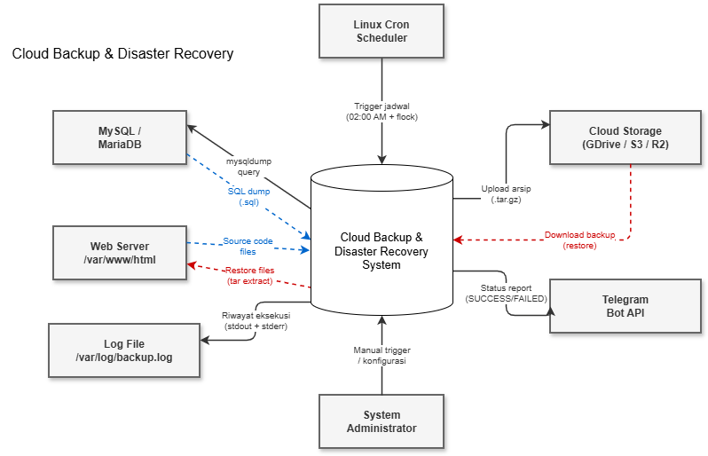
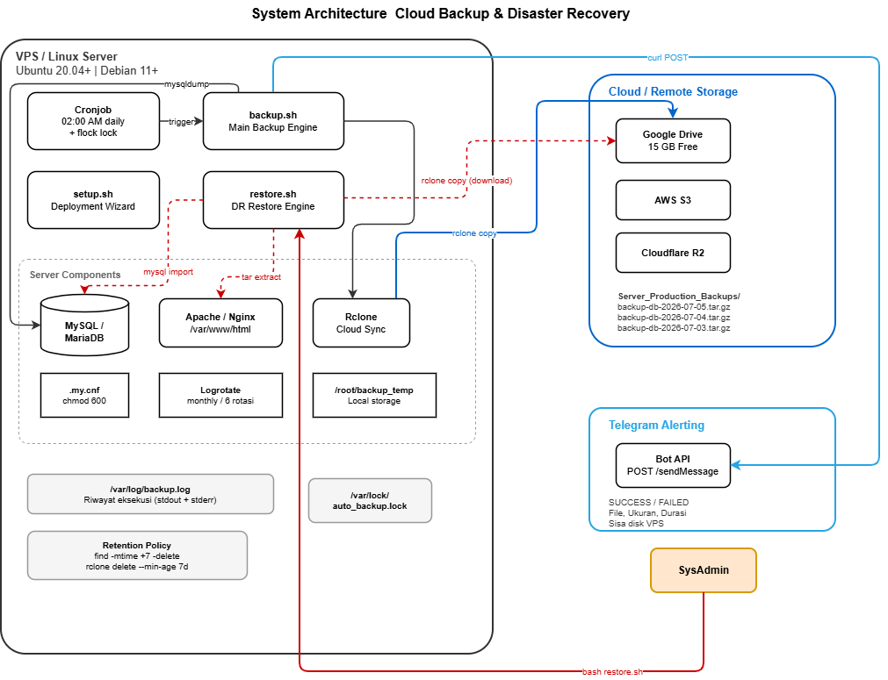

<div align="center">

# Automated Cloud Backup & Disaster Recovery

Backup database & file web secara otomatis setiap malam, upload ke cloud storage, bersihkan file lama, kirim laporan ke Telegram dan ketika server hancur, pulihkan semuanya dalam satu perintah.

</div>

Di dunia cloud hosting, ada satu prinsip yang sering diabaikan sampai semuanya sudah terlambat:

> *"Backup yang tidak pernah diuji pemulihannya bukan backup  itu cuma harapan."*

Setiap hari, perusahaan hosting menghadapi dua ancaman yang sangat nyata:

**Pertama, kehilangan data.** Server bisa down kapan saja  karena serangan ransomware, kesalahan konfigurasi, atau sekadar hardware yang sudah tua. Ketika itu terjadi, klien menuntut pemulihan dalam hitungan menit, bukan jam.

**Kedua, disk server penuh.** Ini lebih sering terjadi dari yang orang kira. File backup menumpuk di server yang sama tanpa ada mekanisme pembersihan. Lama-lama disk terisi 100%, database crash, dan website ikut tumbang  padahal bukan karena serangan, tapi karena kelalaian.

Proyek ini dibangun untuk menyelesaikan kedua masalah tersebut sekaligus. Bukan sekadar skrip backup biasa, tapi sistem automasi lengkap yang berjalan sendiri tanpa perlu disentuh manusia  dan ketika bencana benar-benar terjadi, ada mekanisme pemulihan yang sudah teruji dan bisa dijalankan dengan satu perintah.


## Arsitektur Sistem

Seluruh proses berjalan otomatis setiap malam pukul 02:00 WIB, saat trafik server sedang paling rendah. Diagram berikut menunjukkan alur data dari awal sampai akhir  mulai dari trigger cronjob, dump database, kompresi file, upload ke cloud, sampai notifikasi ke Telegram.




Diagram di atas menunjukkan sistem sebagai satu kesatuan dan bagaimana ia berinteraksi dengan komponen-komponen eksternal: Linux Cron sebagai trigger, MySQL sebagai sumber data, Cloud Storage sebagai tujuan backup, dan Telegram sebagai kanal notifikasi. Garis putus-putus merah menunjukkan alur restore saat terjadi bencana.

### Deployment Architecture



Diagram arsitektur ini menunjukkan tata letak fisik komponen di dalam server (VPS) dan bagaimana masing-masing terhubung ke layanan eksternal. Perhatikan bahwa `backup.sh` dan `restore.sh` adalah dua skrip independen  satu untuk operasi harian otomatis, satu lagi untuk skenario pemulihan darurat yang dijalankan manual oleh SysAdmin.

Jika backup kemarin belum selesai karena jaringan lambat atau data terlalu besar, **flock** secara otomatis membatalkan eksekusi hari ini — server tidak akan crash karena dua proses backup berjalan bersamaan.

---

## Fitur Utama

### Ekstraksi & Kompresi Data

Skrip mengamankan dua komponen paling kritis dari sebuah website:

| Komponen | Apa isinya | Bagaimana diamankan |
|----------|-----------|---------------------|
| **Database** | Konten, data user, transaksi | `mysqldump --single-transaction` mengekspor tanpa mengunci tabel, jadi website tetap bisa diakses selama backup berjalan |
| **File Website** | Source code, gambar, plugin, konfigurasi | `tar -czf` menggabungkan semuanya jadi satu arsip terkompresi |

Kenapa pakai format `.tar.gz` dan bukan `.zip`? Karena tar mempertahankan file permissions dan ownership di Linux. Kalau pakai zip, saat restore nanti permission file bisa berubah dan website malah error. Selain itu, gzip menghasilkan ukuran file yang lebih kecil — penting kalau bandwidth server terbatas.

### Upload ke Remote Storage (Offsite Backup)

Menyimpan backup di server yang sama dengan data aslinya itu sama saja dengan tidak punya backup. Kalau server kena hack, backup-nya juga ikut hilang.

Proyek ini menggunakan [Rclone](https://rclone.org/) untuk mengirim file backup ke penyimpanan eksternal secara otomatis. Rclone mendukung lebih dari 40 provider cloud storage — mulai dari Google Drive (15 GB gratis), AWS S3, sampai Cloudflare R2. Cukup konfigurasi sekali, dan setiap malam file backup dikirim tanpa perlu campur tangan.

### Retention Policy (Manajemen Umur File Backup)

Tanpa mekanisme pembersihan, file backup akan terus menumpuk — 30 file per bulan, 365 per tahun. Dalam beberapa bulan, disk server bisa penuh 100% dan menyebabkan crash.

Skrip ini mengimplementasikan retention policy sederhana tapi efektif:

```bash
# Hapus file lokal yang lebih tua dari 7 hari
find /root/backup_temp -type f -name "backup-*.tar.gz" -mtime +7 -delete

# Hapus file remote yang lebih tua dari 7 hari
rclone delete gdrive-backup:Server_Production_Backups --min-age 7d
```

Angka 7 hari bisa disesuaikan lewat variabel `RETENTION_DAYS` di dalam skrip.

### Notifikasi Real-Time via Telegram

SysAdmin tidak mungkin login ke setiap server tiap pagi hanya untuk mengecek apakah backup tadi malam berhasil atau tidak. Skrip ini mengirim laporan otomatis ke grup Telegram begitu proses selesai:

```
CLOUD BACKUP STATUS REPORT
-------------------------------------------

Status  : SUCCESS
Server  : vps-production (103.xx.xx.xx)
Waktu   : 2026-07-05 02:00:45 WIB
File    : backup-production_db-2026-07-05_02-00-00.tar.gz
Ukuran  : 145M
Durasi  : 45 detik
Disk    : 34% terpakai (sisa 12G)
Cleanup : 2 file lama dihapus

Sistem berjalan otomatis tanpa interaksi manusia.
```

Kalau backup gagal, notifikasi yang dikirim berbeda  langsung menyebutkan di tahap mana proses gagal dan apa penyebabnya, supaya SysAdmin bisa langsung investigate tanpa harus buka log dulu.

---

## Standar Keamanan

### Zero-Plaintext Password

Menulis password database langsung di dalam skrip bash itu kesalahan fatal di lingkungan produksi. Siapa pun yang mengetik `ps aux` di terminal bisa melihat password yang sedang dipakai oleh proses `mysqldump`.

Proyek ini menyimpan kredensial di file terpisah `/root/.my.cnf` dengan permission `chmod 600` — artinya hanya user root yang bisa membacanya:

```ini
# /root/.my.cnf
[client]
user=root
password="PasswordDatabase"
host=localhost
```

```bash
# mysqldump membaca password dari file, bukan dari parameter command line
mysqldump --defaults-extra-file=/root/.my.cnf production_db > backup.sql
```

Hasilnya, password tidak pernah muncul di output `ps aux`, tidak tercatat di bash history, dan tidak terekspos ke user lain di server yang sama.

### Concurrency Control dengan flock

Bayangkan skenario ini: backup hari Senin butuh waktu 3 jam karena jaringan lambat. Pukul 02:00 Selasa, cronjob berikutnya mulai berjalan padahal yang kemarin belum selesai. Sekarang ada dua proses backup yang berjalan bersamaan  keduanya membaca database, menulis file besar, dan upload ke cloud secara paralel. Hasilnya: I/O disk melonjak 100%, CPU overload, dan server hang.

Solusinya sederhana tapi efektif — **flock** (file lock):

```bash
0 2 * * * /usr/bin/flock -n /var/lock/auto_backup.lock /bin/bash /root/scripts/backup.sh
```

Flag `-n` berarti non-blocking. Kalau file lock masih aktif (backup kemarin belum selesai), cronjob hari ini langsung dibatalkan tanpa menunggu — server tetap stabil.

### Log Rotation

File log yang dibiarkan tanpa pengelolaan bisa tumbuh sampai ber-gigabyte setelah beberapa bulan. Proyek ini menyertakan konfigurasi logrotate yang memotong log setiap bulan, mengompresnya, dan hanya menyimpan 6 bulan riwayat terakhir:

```
/var/log/backup.log {
    monthly
    rotate 6
    compress
    delaycompress
    missingok
    notifempty
    create 644 root root
}
```

---

## Struktur Direktori

```
.
├── scripts/
│   ├── backup.sh              # Skrip backup utama (produksi)
│   ├── restore.sh             # Skrip pemulihan otomatis (disaster recovery)
│   └── setup.sh               # Skrip inisialisasi & deployment
├── config/
│   ├── auto_backup.logrotate  # Konfigurasi logrotate
│   ├── cronjob.txt            # Template cronjob dengan flock
│   └── my.cnf.example         # Template kredensial database
├── docs/
│   ├── disaster-recovery-playbook.md  # Playbook DR lengkap
│   ├── 1-DFD-Level-0-Context.drawio   # DFD Level 0 (editable)
│   ├── 2-DFD-Level-1-Detail.drawio    # DFD Level 1 (editable)
│   ├── 3-System-Architecture.drawio   # Arsitektur sistem (editable)
│   └── 4-ERD-Entity-Relationship.drawio # ERD (editable)
├── image/
│   ├── 1.drawio.png           # Export DFD Level 0
│   └── 2.drawio.png           # Export System Architecture
├── README.md
├── LICENSE
└── .gitignore
```

---

## Cara Install dan Menjalankan

### Prasyarat

- Server Linux (Ubuntu 20.04+, Debian 11+, atau CentOS 7+)
- MySQL atau MariaDB sudah terinstall dan berjalan
- Web server (Apache / Nginx) dengan website aktif di `/var/www/html/`
- Akun Google Drive atau cloud storage lain yang didukung Rclone
- Telegram Bot (opsional, tapi sangat direkomendasikan)

### Instalasi Otomatis

Cara paling cepat  clone repo lalu jalankan setup wizard:

```bash
# Clone dan masuk ke direktori
git clone https://github.com/USERNAME/cloud-backup-dr.git && cd cloud-backup-dr

# Jalankan setup wizard sebagai root
sudo bash scripts/setup.sh
```

Setup wizard akan menangani semuanya secara interaktif:
- Install dependensi yang belum ada (rclone, mysql-client, curl, logrotate)
- Buat struktur direktori yang dibutuhkan
- Copy skrip backup dan restore ke `/root/scripts/`
- Minta input kredensial database dan membuat `.my.cnf` dengan permission 600
- Memandu konfigurasi Rclone remote
- Mendaftarkan cronjob dengan proteksi flock
- Deploy konfigurasi logrotate
- Menjalankan validasi akhir untuk memastikan semua komponen siap

### Instalasi Manual

<details>
<summary>Klik untuk melihat langkah-langkah manual</summary>

```bash
# 1. Install dependensi
sudo apt update && sudo apt install -y curl mysql-client tar gzip logrotate cron
curl https://rclone.org/install.sh | sudo bash

# 2. Konfigurasi Rclone remote
rclone config
# Pilih: n (New remote) --> Nama: gdrive-backup --> Tipe: Google Drive --> OAuth

# 3. Buat file kredensial database
sudo cp config/my.cnf.example /root/.my.cnf
sudo nano /root/.my.cnf          # Ganti dengan password database asli
sudo chmod 600 /root/.my.cnf

# 4. Deploy skrip ke server
sudo mkdir -p /root/scripts
sudo cp scripts/backup.sh scripts/restore.sh /root/scripts/
sudo chmod +x /root/scripts/*.sh

# 5. Sesuaikan konfigurasi di backup.sh
sudo nano /root/scripts/backup.sh
# Yang perlu diubah: DB_NAME, TELEGRAM_BOT_TOKEN, TELEGRAM_CHAT_ID

# 6. Deploy logrotate
sudo cp config/auto_backup.logrotate /etc/logrotate.d/auto_backup

# 7. Daftarkan cronjob
crontab -e
# Tambahkan baris berikut:
# 0 2 * * * /usr/bin/flock -n /var/lock/auto_backup.lock /bin/bash /root/scripts/backup.sh >> /var/log/backup.log 2>&1

# 8. Test jalankan secara manual untuk memastikan semuanya bekerja
sudo bash /root/scripts/backup.sh
```

</details>

---

## Konfigurasi

### Variabel Utama di `backup.sh`

| Variabel | Default | Keterangan |
|----------|---------|------------|
| `BACKUP_DIR` | `/root/backup_temp` | Tempat menyimpan file backup sebelum diupload |
| `WEB_DIR` | `/var/www/html` | Direktori root website yang akan di-backup |
| `DB_NAME` | `production_db` | Nama database MySQL/MariaDB |
| `RCLONE_REMOTE` | `gdrive-backup` | Nama remote yang sudah dikonfigurasi di Rclone |
| `RCLONE_FOLDER` | `Server_Production_Backups` | Nama folder tujuan di cloud storage |
| `TELEGRAM_BOT_TOKEN` | — | Dapatkan dari @BotFather di Telegram |
| `TELEGRAM_CHAT_ID` | — | Dapatkan dari @userinfobot di Telegram |
| `RETENTION_DAYS` | `7` | Berapa hari file backup disimpan sebelum dihapus |

### Cara Setup Telegram Bot

1. Buka Telegram, cari **@BotFather**
2. Kirim `/newbot`, ikuti instruksinya, dan catat **Bot Token** yang diberikan
3. Cari **@userinfobot**, kirim pesan apa saja, dan catat **Chat ID** kamu
4. Masukkan kedua nilai tersebut ke dalam variabel di `backup.sh`

### Cara Setup Rclone untuk Google Drive

```bash
rclone config

# Ikuti wizard:
# n     --> buat remote baru
# Name  --> gdrive-backup
# Type  --> Google Drive (pilih nomor yang sesuai)
# Scope --> 1 (Full access)
# Sisanya bisa dikosongkan (tekan Enter)
# Auto config --> y
# Browser akan terbuka untuk autentikasi OAuth

# Verifikasi koneksi berhasil:
rclone lsd gdrive-backup:
```

---

## Simulasi Disaster Recovery

Bagian ini adalah inti dari proyek ini. Bukan cuma bisa backup tapi bisa membuktikan bahwa backup tersebut **benar-benar bisa dipakai** untuk memulihkan server yang hancur total.

**Skenario:** Website klien tiba-tiba tidak bisa diakses. Setelah dicek, ternyata database terhapus dan sebagian file website corrupt akibat kesalahan update. Server perlu dipulihkan secepat mungkin.

### Metode 1: Automated Recovery (Rekomendasi)

Satu perintah, seluruh server pulih:

```bash
/bin/bash /root/scripts/restore.sh
```

Skrip ini secara otomatis:
1. Mencari dan mengunduh file backup terbaru dari cloud storage
2. Mengekstrak seluruh file website ke `/var/www/html/`
3. Mengimpor database SQL kembali ke MySQL
4. Mengatur ownership dan permission file (www-data, 755/644)
5. Memverifikasi website sudah kembali online (HTTP 200)
6. Mengirim laporan pemulihan ke Telegram

Contoh output saat dijalankan:

```
==============================================================
  AUTOMATED DISASTER RECOVERY ENGINE
  One-Click Server Restoration System
==============================================================

STEP 1: Mengunduh arsip backup dari Cloud Storage...
  File backup target: backup-production_db-2026-07-05_02-00-00.tar.gz
  Download selesai. Ukuran file: 145M

STEP 2: Mengekstrak file website ke /var/www/html/...
  Ekstraksi file website selesai.

STEP 3: Mengimpor kembali database...
  Database 'production_db' berhasil dipulihkan.

STEP 4: Mengatur izin file & pembersihan...
  Ownership diatur ke www-data:www-data

STEP 5: Verifikasi integritas HTTP endpoint...
  HTTP Status: HTTP/1.1 200 OK
  Website kembali ONLINE dan merespons normal.

==============================================================
  DISASTER RECOVERY REPORT
--------------------------------------------------------------
  Status    : SUCCESS
  Durasi    : 2 menit 34 detik
  HTTP      : 200
==============================================================
```

Kalau ingin me-restore dari file backup tertentu (bukan yang terbaru):

```bash
/bin/bash /root/scripts/restore.sh --file backup-production_db-2026-07-01_02-00-00.tar.gz
```

### Metode 2: Manual Step-by-Step (Untuk Audit & Investigasi)

Kadang kamu perlu kontrol penuh atas setiap tahap  misalnya saat menginvestigasi penyebab kerusakan atau melakukan audit data sebelum restore.

```bash
# 1. Lihat daftar backup yang tersedia di cloud
rclone ls gdrive-backup:Server_Production_Backups

# 2. Download file backup yang diinginkan
mkdir -p /root/recovery_temp
rclone copy "gdrive-backup:Server_Production_Backups" /root/recovery_temp/ \
    --include "backup-*.tar.gz" --progress

# 3. Ekstrak file website
tar -zxvf /root/recovery_temp/backup-*.tar.gz -C /var/www/html/

# 4. Import database
mysql --defaults-extra-file=/root/.my.cnf -e "CREATE DATABASE IF NOT EXISTS production_db;"
mysql --defaults-extra-file=/root/.my.cnf production_db < /var/www/html/*.sql

# 5. Set permission dan ownership
chown -R www-data:www-data /var/www/html/
find /var/www/html -type d -exec chmod 755 {} \;
find /var/www/html -type f -exec chmod 644 {} \;

# 6. Restart web server dan verifikasi
sudo systemctl restart apache2
curl -I -s http://localhost | grep "HTTP/"
# Output yang diharapkan: HTTP/1.1 200 OK
```

Playbook yang lebih lengkap (termasuk troubleshooting) tersedia di [`docs/disaster-recovery-playbook.md`](docs/disaster-recovery-playbook.md).

---

## Dokumentasi Teknis

Selain README ini, proyek ini menyertakan dokumentasi teknis lengkap dalam format yang bisa diedit di [draw.io](https://app.diagrams.net):

| Dokumen | Deskripsi | Format |
|---------|-----------|--------|
| [DFD Level 0 - Context](docs/1-DFD-Level-0-Context.drawio) | Diagram konteks — gambaran besar sistem dan interaksi dengan entitas luar | `.drawio` |
| [DFD Level 1 - Detail](docs/2-DFD-Level-1-Detail.drawio) | Diagram alur data detail — 7 proses internal, 3 data store, termasuk alur restore | `.drawio` |
| [System Architecture](docs/3-System-Architecture.drawio) | Arsitektur deployment — tata letak komponen di VPS, cloud, dan Telegram | `.drawio` |
| [ERD](docs/4-ERD-Entity-Relationship.drawio) | Entity Relationship Diagram — 9 entitas, 10 relasi, atribut lengkap | `.drawio` |
| [DR Playbook](docs/disaster-recovery-playbook.md) | Prosedur pemulihan bencana step-by-step, 2 metode, troubleshooting | `.md` |

File `.drawio` bisa dibuka langsung di [app.diagrams.net](https://app.diagrams.net) lewat **File > Open from > Device**.

---

## Tech Stack

| Teknologi | Peran dalam Sistem | Kenapa Dipilih |
|-----------|--------------------|----------------|
| **Bash** | Bahasa utama seluruh skrip automasi | Native di semua distro Linux, tidak perlu install runtime tambahan |
| **mysqldump** | Ekspor database ke file `.sql` | Mendukung `--single-transaction` sehingga tidak mengunci tabel saat backup |
| **tar + gzip** | Mengarsipkan dan mengompresi file | Mempertahankan file permissions Linux, rasio kompresi lebih baik dari zip |
| **Rclone** | Sinkronisasi ke cloud storage | Mendukung 40+ provider (GDrive, S3, R2, dll.) dengan satu tool |
| **Cronjob** | Penjadwalan eksekusi otomatis | Scheduler bawaan Linux, stabil dan ringan |
| **flock** | File locking untuk mencegah eksekusi ganda | Solusi kernel-level, lebih reliable dari cek PID manual |
| **Logrotate** | Manajemen ukuran file log | Standar industri untuk rotasi log di server Linux |
| **Telegram Bot API** | Notifikasi real-time | Gratis, mudah di-setup, bisa diakses dari HP kapan saja |

---

